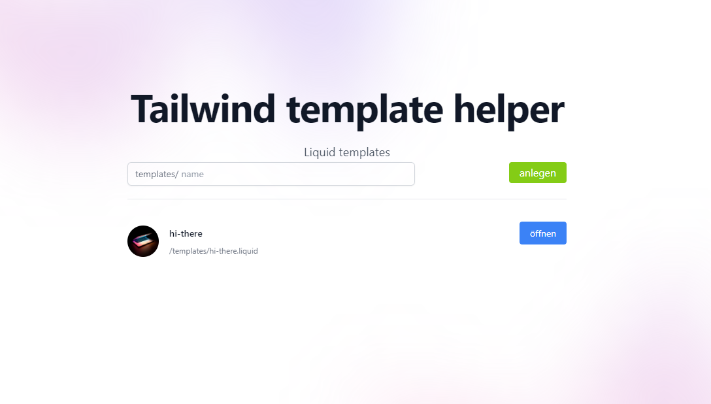
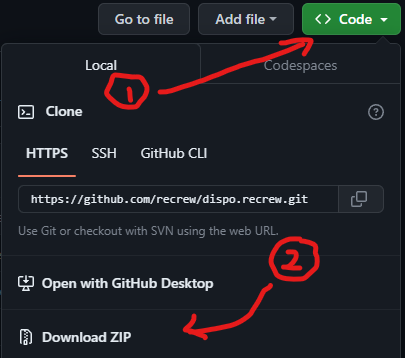

# Tailwind template helper



> This is a low-experience HTML developer in German

## Voraussetzungen

- https://nodejs.org/de

## Setup / Installation

1.  Dieses Paket herunterladen und entpacken.
2. In der shell application zum entpackten Verzeichnis wechseln
3. `npm install`
4. `npm start`
5. Im browser aufrufen: http://localhost:3000

## Quellen

- [Tailwind](https://tailwindcss.com/)
- [Liquid](https://liquidjs.com/)
- [Tailwind UI](https://tailwindui.com/)

## Benutzung

Auf der Startseite können neue Templatedateien angelegt werden, welche in dem Ordner templates angelegt werden.
In den meisten Fällen kann Content zwischen 

```liquid



```

und

```liquid


```
platziert werden.

### Data tips

In Liquid können simple Datenstrukturen einfach nachgebildet werden

```liquid


    <p>{{ var }}</p>

```
Ergebnis:

```html
<p>sam</p>
<p>harris</p>
```

Im Ordner "data" befindliche JSON-Dateien werden automatisch an templates unter ihrem Namen übergeben.
 

Weitere Beispiele im Template data-examples sowie auf https://liquidjs.com/tags/overview.html